# WTWR (What to Wear?)

## About the project

The idea of the application is pretty simple - we make a call to an API, which then responds with the daily weather forecast. We collect the weather data, process it, and then based on the forecast, we recommend suitable clothing to the user.

## Technologies and Techniques Used

- API Integration: Utilizes an external weather API to fetch current weather forecasts.
- Data Processing: Analyzes the weather data to determine suitable clothing recommendations.
- Frontend Development: Developed using React, HTML, CSS, and JavaScript for a user-friendly interface.
- Design: Incorporated Figma design to create an intuitive and visually appealing UI.
- User Authentication: Register, Login and Sign Out
- Work with a full-stack application: Connect Project Express with this Project

## Project Features

- Unauthorized User

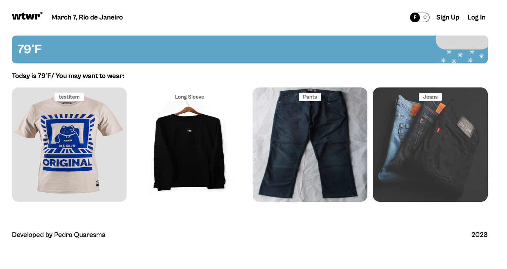

- Register Modal

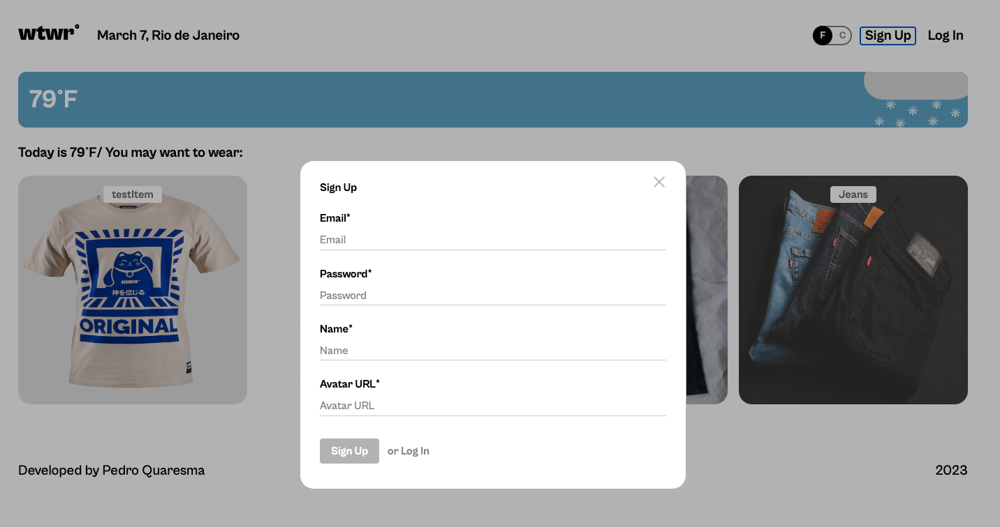

- Login Modal

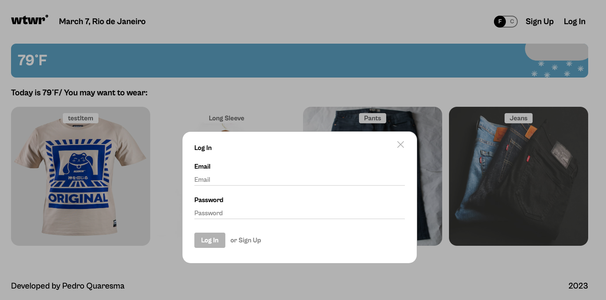

- Authorized User

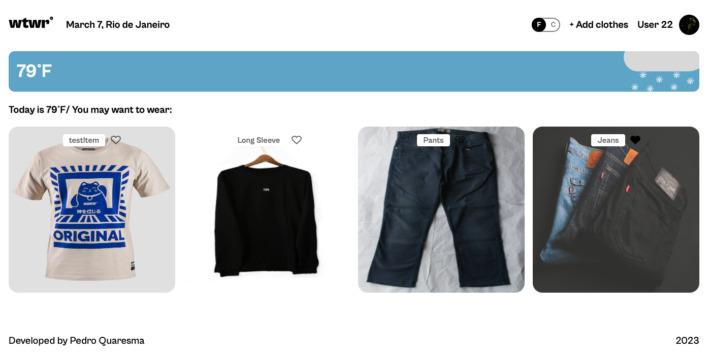

- Update Profile Modal

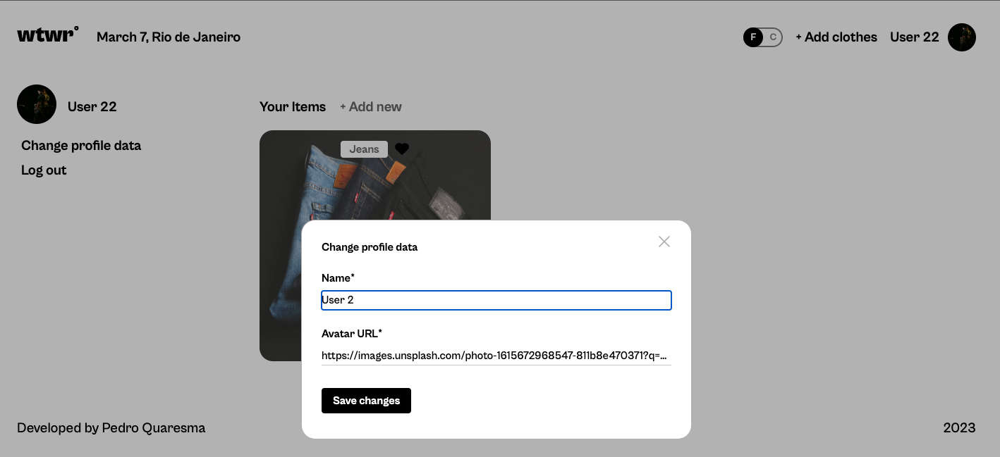

- Filter Clothing Items by Owner and Add Like Functionality

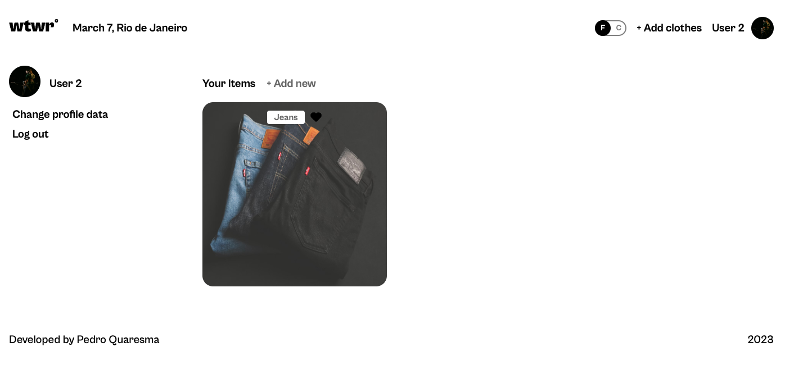

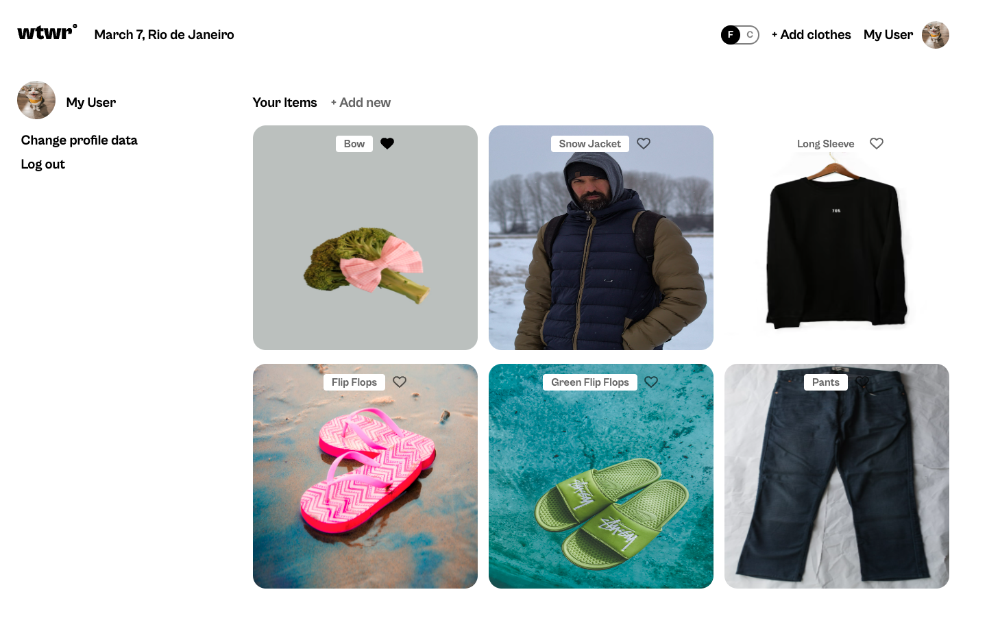

- Delete Button only visible if User is also Owner

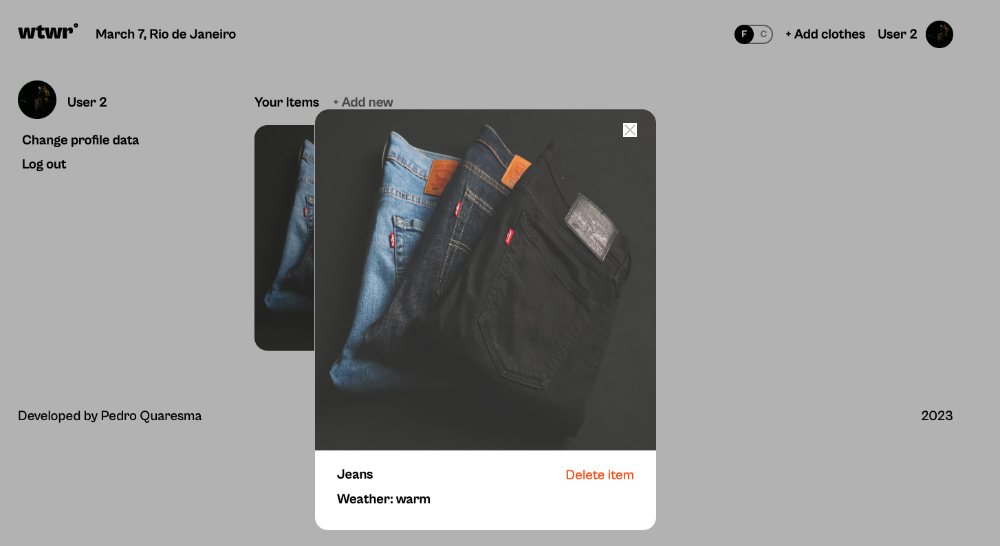

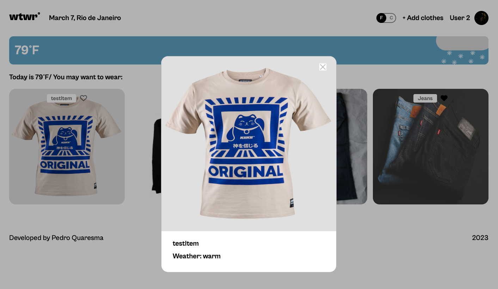

- Filter Clothes based on Weather Temp

- Open Add new garment Modal

- Open Preview Modal with Delete Functionality

Old Version

Updated Version

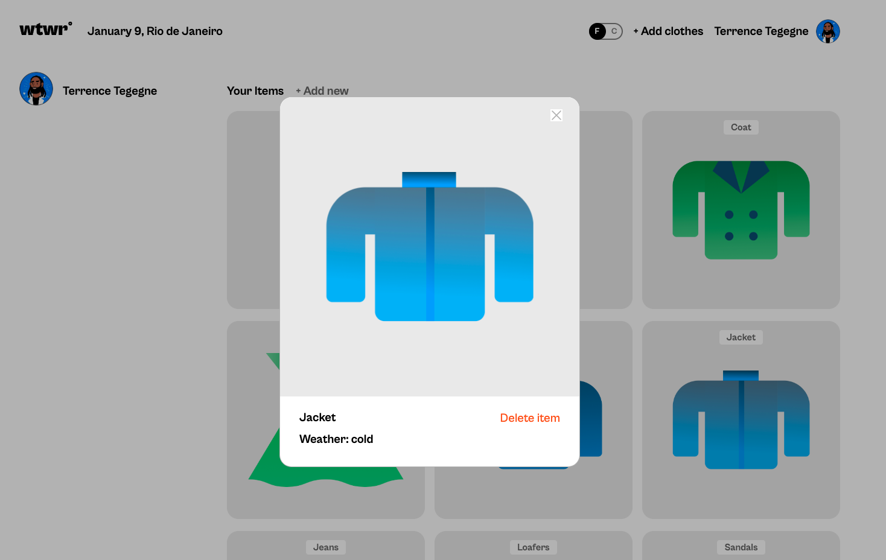

- Open Delete Modal

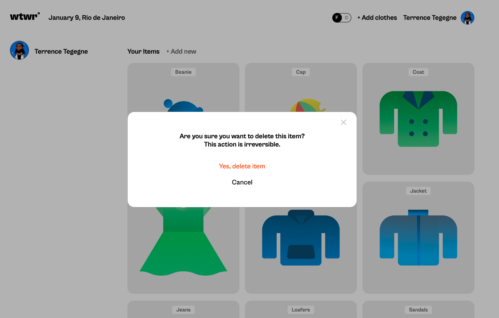

- Close modal on Overlay and on Esc Key

- Toggle Switch to change temperature unit

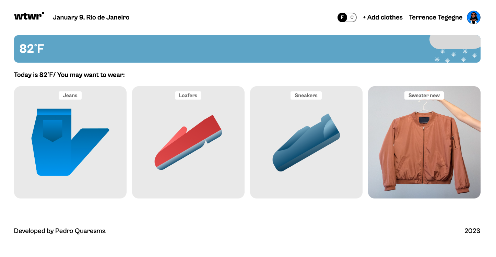

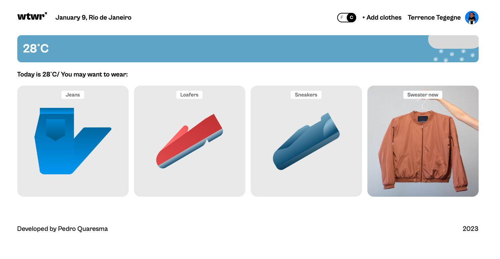

- New Path Added - Profile Section

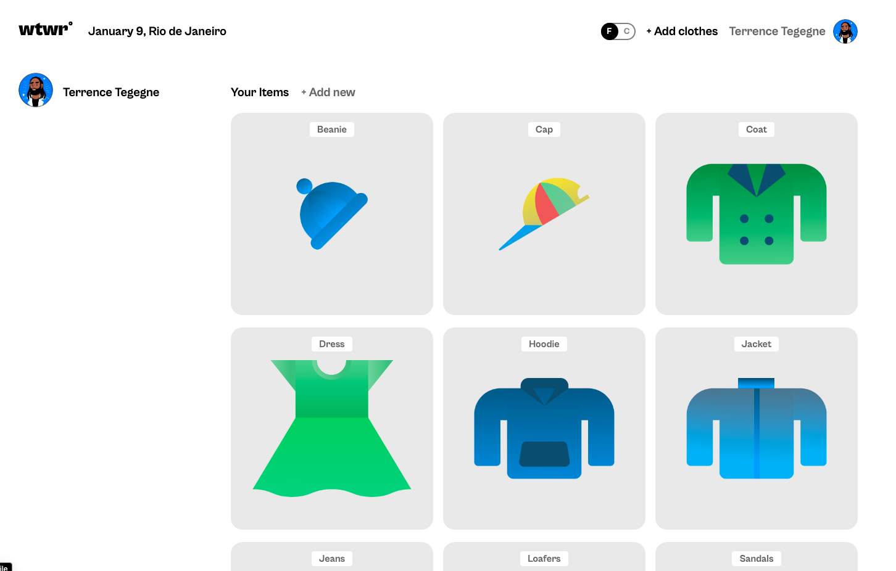

Displays user information and all clothes items

## Links

- [Figma Design](https://www.figma.com/file/DTojSwldenF9UPKQZd6RRb/Sprint-10%3A-WTWR)

- [Project Express](https://github.com/PQuaresma-94/se_project_express)

## GitHub Page

- [GitHub Pages](https://pquaresma-94.github.io/se_project_react)
