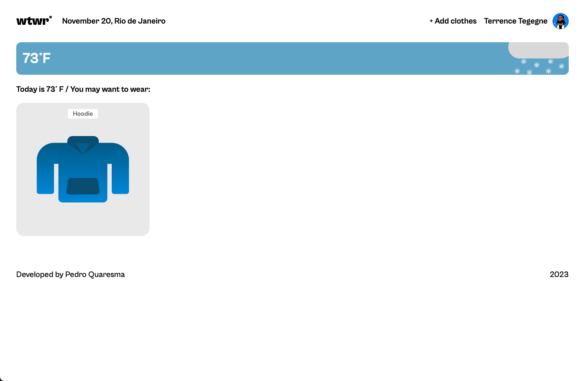
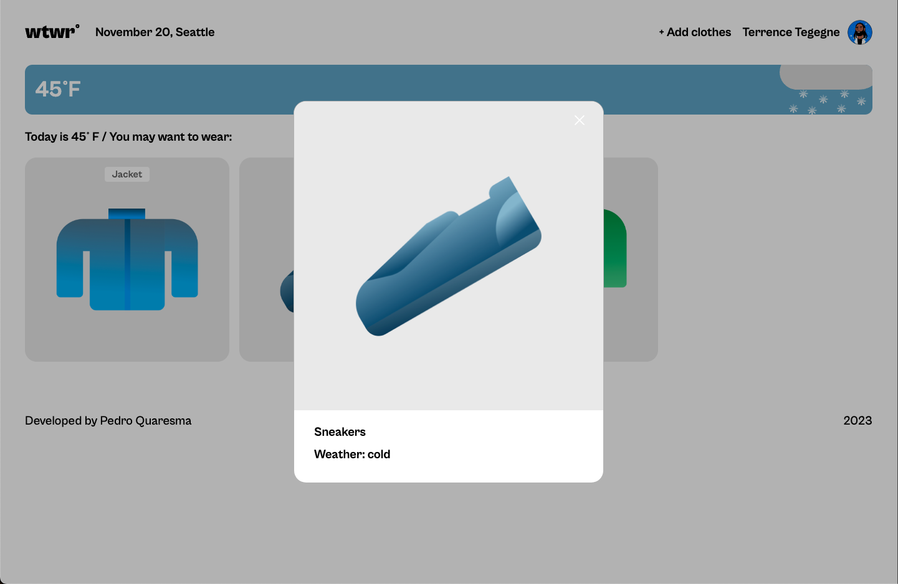

# WTWR (What to Wear?)

## About the project

The idea of the application is pretty simple - we make a call to an API, which then responds with the daily weather forecast. We collect the weather data, process it, and then based on the forecast, we recommend suitable clothing to the user.

## Technologies and Techniques Used

- API Integration: Utilizes an external weather API to fetch current weather forecasts.
- Data Processing: Analyzes the weather data to determine suitable clothing recommendations.
- Frontend Development: Developed using React, HTML, CSS, and JavaScript for a user-friendly interface.
- Design: Incorporated Figma design to create an intuitive and visually appealing UI.

## Project Features

- Filter Clothes based on Weather Temp

- Open Add new garment Modal

- Open Preview Modal

- Close modal on Overlay and on Esc Key

## Links

- [Figma Design](https://www.figma.com/file/DTojSwldenF9UPKQZd6RRb/Sprint-10%3A-WTWR)

## GitHub Page

To be added
